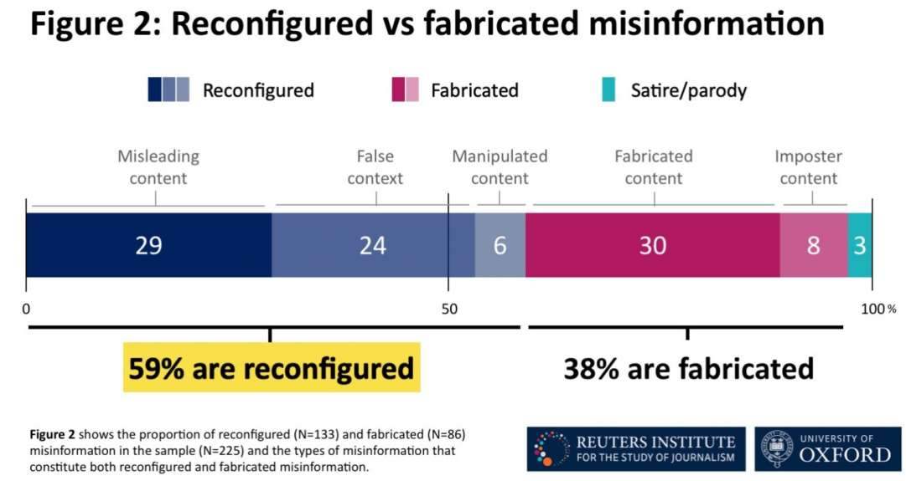
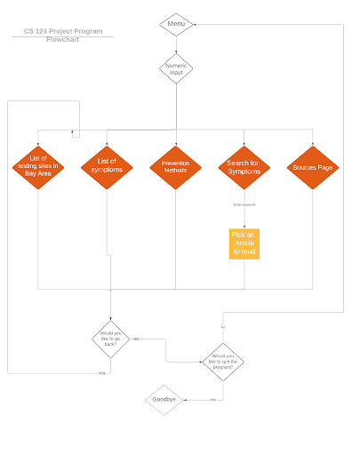

# Spring 2020 CS124 Team Project Report: A COVID-19 Wiki

# • Listing of team members and workload or contributions to the project

## Brian Yu - General design, organization and writing parts of the code

## Kenneth Lai - Research, writing parts of the code

## Vincent Li - Documentation, writing parts of the code

## Zhexian Liu - Debugging, structuring, and writing parts of the code

##• Purpose

The purpose of this assignment is to address an issue related to COVID-19 and implement a solution to it using the various data structures and algorithms we learned from CS 124. Since it is also our first group project in the class, it will also help us develop our collaboration and leadership skills. For our issue, we chose the lack of reliable information out there on COVID-19. As you can see in the figure to the right, according to a study published by Reuters, 38% of false claims regarding COVID-19 are straight up, completely fabricated. Social media is a huge propagator for this type of information, such as misleading videos, "gurus" pushing fake remedies, and comments from the president telling people to inject disinfectants. Because of this, we wanted to create a wiki that would help educate the public and turn them in the right direction. Specifically, this wiki will be targeted towards bay area users since the data we gathered on testing centers are from around here. On the expected impact of our project, we are not expecting the people who stubbornly refuse to wash their hands, or who go to work and meet clients without wearing a mask, to instantly change after reading our wiki. Instead, we are hoping people who wish to become more informed can find an easy place to learn with condensed information.

||
|:--:|
|Misleading Statistics|

##• Planning and organization

Q: What input does the program need from the user? Why?

A: We will need the following inputs from the user:
Choice of operation to be performed
Type in the keyword for searching algorithm
 
Q: If any complex objects were used, how did you decide what objects needed to be defined and used? 

A: We defined several complex objects, and we decide to use a complex object when we are having a piece of information that contains multiple parts. For example, the test location contains address, name, and city, therefore we implemented it as a class.
 
Q: What functions are included and how did you decide which operations go into functions? 

A: The implementations of each function are explained in detail below.
 
Q: What is the program flow? How did you decide on the program flow? 

A: A flowchart has been drawn below.
 
Q: How do you decide that your program is complete?

A: We decided the program was near completion when we started to run out of time. Even though we would've liked to implement more features such as a word suggestion function, we decided it was more important to perfect our existing code than tack on more potentially flawed features.

We began planning our project by brainstorming project ideas that seem feasible on a google doc, these included financial planning services for the people that recently lost their jobs, a shopping list program that helps people keep track of what to buy, and this wiki that provides credible information about COVID-19. After some discussion, we ultimately narrowed it down to this wiki because we thought that it would better demonstrate what we have learned in this class, utilizing the various data structures and algorithms we have worked on in the past, and has a better purpose that is more relevant to the situation we face right now.

To give a better demonstration of our knowledge, we decided to have different features of our wiki utilize different data structures we have learned. Our original brainstorm was to have seven different options, but as time went on and some of our features took too long to implement, we narrowed it down to five features at the end. In order to use these features, the user only needs to input integers to signify which action they would like to take. In the search symptoms function, they need to type in a keyword.
Our organization and planning of the five different features, as well as how specific we want each step to be is demonstrated by the graph below.

||
|:--:|
|Flowchart regarding planning of the program|

Before we start, we defined some general-purpose functions that we found very useful throughout our program. These are all written by Zhexian.

The first of these kinds of programs is the validated function. The purpose of this function is to check if the user input is a viable option. We have a defined range of numbers that are considered valid inputs so if the user input is not verified to be in this range, they are prompted to enter again.

||
|:--:|
|validatedInt function|

The second general-purpose function is the divisionLine() function. divisionLine prints out exactly 90 dashes. This function is used mainly for formatting to divide sections so that the output looks more organized.

||
|:--:|
|divisionLine function|

Our next function is the countLines function. The countLines function is primarily used for our testLocation array. This function will dictate the size of the array so that we can store all the lines in the .txt file sufficiently.

||
|:--:|
|countLines function|

The user should be able to choose the options with a number input. This can be implemented simply enough on a while loop. The user should be able to:

## 1. Get a list of test areas in the bay area

||
|:--:|
|TestLocation array concept|

This will be implemented by having a text file full of test locations. Each line of the text file will have the name, address, then city of a location. In order to print this, we will first use a function to read each piece of text between the separators (commas). We will store the name, address, and city name inside an object of TestLocation class. Then we will store each of these objects into an array of TestLocation type. This will allow us to format the contents of the list at will, and will satisfy the array requirements of the project. The figure below is our TestLocation class which includes the data members, as well as some accessors and mutators we wrote. This class is mostly written by Vincent but was debugged and ran on Zhexian’s computer.

||
|:--:|
|TestLocation class|

Below is the key algorithm that extracted data and recorded in a testLocation array, this can be found in functions.cpp in our readfileloctoarr function. This function is meant to read from the testlocation file, record data, and print it out with a nicely formatted list. 

||
|:--:|
|Function used to parse text file for address, city, name|

In the above function, we go through each character of each line from the text file, and put it into name. When the first comma is encountered, the characters after are stored into address instead then, city. 

## 2. Get a list of symptoms

To implement the symptoms, we need to use a map to link the symptoms to the appropriate description. For better understanding and usage of member functions, Brian created a class called symptom that contains a STL map in its data member. He finished writing all the member functions, and it was debugged and completed on Zhexian's computer. 

||
|:--:|
| Symptom class with member functions, arguably not needed, but is nice making this data immutable. |

For extracting data, we start by streaming in the file to see if it exists. To identify the keys and descriptions, we used the pipe character as a special character as a tool to help differentiate between the various components. The line containing the special character will be stored as a keyword.

||
|:--:|
| Symptoms .txt file, where we have special character to separate keys from values |

For example, in the image above, the first pipe character is on the same line as Fever. Our function will take the line ignoring the pipe character of course and pass “Fever” as a key to our add_entry function. After initializing our key, our function will then read all the lines up to the next pipe character and store all of those lines in a string variable. In this case, after reading “Fever”, our function will read all of the lines up to the next pipe character which is located at “Cough”. We will then pass the string variable to our add_entry function as the value to which the key will be associated with. The steps listed above will be applied for every symptom in the .txt file. The lines of code to implement these steps is pictured below:  

||
|:--:|
| Creating and passing keys and values |

Our add_entry function will add a new entry to the map:

||
|:--:|
| add_entry function |

After creating the map, our print function will give the user a choice of which symptom and description that they want to see. We created a vector of keys and based on the choice, we redirect them to the appropriate key which is connected to the appropriate description.

||
|:--:|
| Print function |

The process can be summarized by the image below:

||
|:--:|
| Map concept |

## 3. Prevention Methods

The user will be able to see what different prevention methods there are. We will implement this using a linked list connecting nodes of information to each other to allow for access to any specific prevention method. In order to do this, we will use functions that we practiced with when we were initially learning about linked lists such as addatend. This feature was finished by Kenneth alone, and ran and debugged in Zhexian’s computer during our meetings.

||
|:--:|
| Passing lines to buildList function |

Our buildList function is similar to the addAtEnd function that we practiced implementing in class:

||
|:--:|
| buildList function |

After the linked list is built, we use a print function to display the contents of the list:

||
|:--:|
| Print function |

The whole process can be summarized by the image below:

||
|:--:|
| Linked list concept |

## 4. Search for symptoms

We thought of many possibilities of a search function, including binary searching an array, searching using STL member functions, or even linear searching. Obviously linear searching is very slow and inefficient, searching using an STL library member function does not reflect our understanding, and using a binary search on an array needs us to sort the array of words, which is also unnecessary for us. After learning the Binary Search Tree we thought that it fits our needs perfectly. We can insert each word into a Binary search tree which is naturally sorted, and because of this the search function implemented in this is naturally a binary search. The BST class is written by Brian, and this whole feature is finished by Brian and Zhexian together. 

||
|:--:|
| Binary search tree class |

||
|:--:|
| Binary search function(count) |

This binary search tree is inspired by the one detailed in the book. Through the use of Nodes and a Tree structure, we are able to write a count function that returns 1 if the item is found, and 0 if the item is not found. 

For extracting data we used an array of Binary search trees, with symptom names as the root node. It can be summarized by the graph below. 

||
|:--:|
| Binary search tree concept |

We began by separating the words using a split function, which we encountered some trouble on, but we solved using the help from Kenneth’s algorithm from lab 2, extracting all the punctuations out. 

||
|:--:|
| Splite function |

The split function that returns a vector of words that can be inserted into each tree one by one. 
We wrote a function called filetoTree() in the tree.cpp file in our source code. All of the remaining steps are done through that file, where we let the user type in a word that returns a list of symptoms that contain that word. It’s too long to include here, and to be fair, it's painful to read, so here's a summary. 

We build everything and put all the words in their respective trees. The program then prompts the user of what they want to search, which returns the keyword that contains their search item.

The user will then select the symptom that they want to read about. After they are finished they can decide if they want to continue or exit. 

We used many arrays and vectors, as well as member functions to keep track of which elements are which, and it is quite confusing to read. There are still many room for improvements for searching, and we will include it in the Possible Improvements section.

## 5. Backtracking

||
|:--:|
| Backtracking stack concept |

For the backtracking function, we took whatever choice the user inputted and pushed it to a stack called pages -> pages.push(choice). This will be the corresponding page to the 5 options (list of symptoms, test centers etc.). When the user indicates they want to go back in the main menu, it does pages.pop() and now reverts the user's "choice" back to the previous page they were at. Here’s the code that implements the backtracking function in main.

||
|:--:|
| Main menu |

## Product

The user will be first prompt with the main menu that contains all the options, and they can make a choice by entering an integer. Here is the runtime output for option 1.

||
|:--:|
| All the user inputs are validated in order to prevent from ending the program ungracefully due to bad input |

After displaying the corresponding content of each option, the user will be prompted with the following options:

||
|:--:|
| The user can choose to quit the program, back to main menu, or go back to previous page |

If the user is currently at the first page they viewed, he will be told that there’s no previous page to view:

||
|:--:|
| Can’t go back anymore since the user is at the first page |

Here is the runtime output for option 2:

||
|:--:|
| At the end, the user can choose to either go back to the main menu or look at another symptom |

Here is the runtime output for option 3, prevention methods:

||
|:--:|
| Option 3 |

Here is the runtime output for option 4 search for symptoms. The user will be asked to enter a keyword that he wants to know if it’s related to any symptom, and then the list of symptoms that contains the keyword will be printed on screen for the user to choose from.

||
|:--:|
| Runtime output for option 4 |

For option 5, the list of sources will be printed on the screen to give credit to all the the sources of information for this program:

||
|:--:|
| Runtime output for option 5 |

To implement all the components of a linked list, we first have a .txt file with all of the prevention tips on individual lines as shown below:

||
|:--:|
| .txt file |

The prevention tips are streamed in via an ifstream function and stored in a temporary string variable. The variable is then passed to our build list function which is similar to the addatend will create nodes for each line. The nodes are then connected to each other via pointer as defined in our class. After we build our list, we print out the data stored in all the nodes via our print function. The print function will keep printing out the information until a null pointer is encountered.

||
|:--:|
| Prevention method linked list printed |

## Pitfalls

Pitfall #1:

When we were working on the part which allows the user to go back to the previous page, we had problems locating where we should push back the page number and when we should take the top number and pop it. Also, another problem we have to address is that we have to prompt the user when they are already at the first page they viewed, which means there will be lots of things to check before an operation to the stack we use to store page numbers.

Original Error with backtracking : http://cpp.sh/8r7ej

